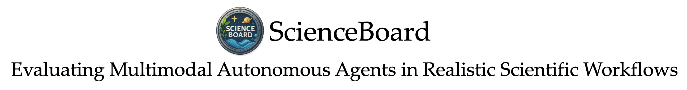

[](https://arxiv.org/abs/2505.19897) 

[](https://huggingface.co/papers/2505.19897)

Code, environment and data for "ScienceBoard: Evaluating Multimodal Autonomous Agents in Realistic Scientific Workflows"

## Updates
- **2025-05-27**: Initial release of our [paper](https://arxiv.org/abs/2505.19897), environment, benchmark, and [project page](https://qiushisun.github.io/ScienceBoard-Home/). Check it out! 🚀

## Usage
### Installation
The infrastructure of the framework is based on [OSWorld](https://github.com/xlang-ai/OSWorld) together with VMware Workstation Pro (which is free for personal use since May, 2024) in Ubuntu or Windows. Please make sure that your device meets the minimal requirements of these preliminaries.

1. Download [VMware Workstation Pro 17](https://support.broadcom.com/group/ecx/productdownloads?subfamily=VMware%20Workstation%20Pro&freeDownloads=true) and our pre-made images from Hugging Face (WIP);
2. Clone this repository and install packages needed:

    ```shell
    git clone https://github.com/OS-Copilot/ScienceBoard
    cd ScienceBoard
    conda create -n sci python=3.11
    conda activate sci
    pip install -r requirements.txt
    ```

3. We recommend you to change evaluating process in `main.py` directly with some sensitive information hidden in environment variables.

### Env Config
#### As a functionality
- `DEBUG_ERR_FACT`: insert a breakpoint when eval exception occur if set to any value;

#### As a storage location for sensitive info
1. Used in our template of `main.py`:
    - `VM_PATH`: path to vmware .vmx file;
    - `HTTPX_PROXY`: proxy URL; avoid clashes with `HTTP_PROXY` and `HTTPS_PROXY` on Linux;
    - `OPENAI_API_KEY`: API key for OpenAI GPT;
    - `GOOGLE_API_KEY`: API key for Google Gemini;
    - `ANTHROPIC_API_KEY`: API key for Anthropic Claude;

    and variables for open-source models:

    |  Model   |    Base URL     |       Name       |
    | :------: | :-------------: | :--------------: |
    |  QwenVL  |  `QWEN_VL_URL`  |  `QWEN_VL_NAME`  |
    | InternVL | `INTERN_VL_URL` | `INTERN_VL_NAME` |
    |   QVQ    |  `QVQ_VL_URL`   |  `QVQ_VL_NAME`   |
    | OS-Atlas |  `OS_ACT_URL`   |  `OS_ACT_NAME`   |
    | UI-Tars  | `TARS_DPO_URL`  | `TARS_DPO_NAME`  |

2. Used in `sci/Presets.py`:
    - `LEAN_LIB_PATH`: path for Lean 4 REPL;
    - `QT6_LIB_PATH`: dynamic library directory for Qt6;
    - `FFI_LIB_PATH`: dynamic library file for libffi.so;
    - `KALG_BIN_PATH`: executable binary file of KAlgebra;
    - `CELE_BIN_PATH`: executable binary file of Celestia;
    - `GIS_BIN_PATH`: executable binary file of Grass GIS.

    these configs are only used for debugging under `Raw` settings and would not be loaded unless being used.

### Possible Exceptions
1. Error when initializing:

    ```shell
    Traceback (most recent call last):
        File "/usr/lib/python3.11/site-packages/requests/models.py", line 971, in json
            return complexjson.loads(self.text, **kwargs)
                ^^^^^^^^^^^^^^^^^^^^^^^^^^^^^^^^^^^^^^
        File "/usr/lib/python3.11/json/__init__.py", line 346, in loads
            return _default_decoder.decode(s)
                ^^^^^^^^^^^^^^^^^^^^^^^^^^
        File "/usr/lib/python3.11/json/decoder.py", line 337, in decode
            obj, end = self.raw_decode(s, idx=_w(s, 0).end())
                    ^^^^^^^^^^^^^^^^^^^^^^^^^^^^^^^^^^^^^^
        File "/usr/lib/python3.11/json/decoder.py", line 355, in raw_decode
            raise JSONDecodeError("Expecting value", s, err.value) from None
        json.decoder.JSONDecodeError: Expecting value: line 1 column 1 (char 0)
    ```

    the target app has not yet been started up when trying to initialize due to insufficient performance of your device; try to assign a bigger value for 'wait' field in json files of the tasks.

2. Failed to get accessibility tree:

    ```shell
    Traceback (most recent call last):
        File "os-sci/sci/Tester.py", line 396, in __call__
            counter._pass() if task_info() else counter._fail()
                            ^^^^^^^^^^^
        File "os-sci/sci/Tester.py", line 174, in __call__
            return self.task()
                ^^^^^^^^^^^
        File "os-sci/sci/base/task.py", line 175, in _avail_wrapper
            return method(self, *args, **kwargs)
                ^^^^^^^^^^^^^^^^^^^^^^^^^^^^^
        File "os-sci/sci/base/task.py", line 393, in __call__
            return self.__call()
                ^^^^^^^^^^^^^
        File "os-sci/sci/base/task.py", line 381, in __call
            stop_type, stop_args = self.predict()
                                ^^^^^^^^^^^^^^
        File "os-sci/sci/base/task.py", line 175, in _avail_wrapper
            return method(self, *args, **kwargs)
                ^^^^^^^^^^^^^^^^^^^^^^^^^^^^^
        File "os-sci/sci/base/log.py", line 462, in record_wrapper
            return_value = method(self)
                        ^^^^^^^^^^^^
        File "os-sci/sci/base/task.py", line 316, in predict
            invalid = self._step(step_index)
                    ^^^^^^^^^^^^^^^^^^^^^^
        File "os-sci/sci/base/task.py", line 260, in _step
            observation = {
                        ^
        File "os-sci/sci/base/task.py", line 261, in <dictcomp>
            obs_type: getattr(self.manager, obs_type)()
                    ^^^^^^^^^^^^^^^^^^^^^^^^^^^^^^^^^
        File "os-sci/sci/vm/vmanager.py", line 152, in _env_wrapper
            return method(self, *args, **kwargs)
                ^^^^^^^^^^^^^^^^^^^^^^^^^^^^^
        File "os-sci/sci/base/manager.py", line 85, in _assert_wrapper
            result = method(self)
                    ^^^^^^^^^^^^
        File "os-sci/sci/vm/vmanager.py", line 278, in a11y_tree
            a11y_tree = utils.linearize(raw_a11y_tree)
                        ^^^^^^^^^^^^^^^^^^^^^^^^^^^^^^
        File "os-sci/sci/vm/utils.py", line 206, in linearize
            filtered_nodes = filter_nodes(ET.fromstring(a11y_tree), platform)
                                        ^^^^^^^^^^^^^^^^^^^^^^^^
        File "/usr/lib/python3.11/xml/etree/ElementTree.py", line 1338, in XML
            parser.feed(text)
        TypeError: a bytes-like object is required, not 'NoneType'
    ```

    fail to authenticate in newly downloaded images; input password once manually in VMWare and take a new snapshot using the same name as before and delete the former one.

## Development Manual
### Introduction of New Apps
If you are willing to add new applications into ScienceBoard, please make sure that you already have a full understanding of your target application and this repository.

1. Write a plugin or implant a server in your target application revealing its inner states. Listed below is repositories of our modified applications:
    - [chimerax-states](https://github.com/ShiinaHiiragi/chimerax-states): a plugin for ChimeraX;
    - [kalgebra](https://github.com/ShiinaHiiragi/kalgebra): a recompilation copy of KAlgebra;
    - [Celestia](https://github.com/ShiinaHiiragi/Celestia): a recompilation copy of Celestia;
    - [grass-gis](https://github.com/ShiinaHiiragi/grass-gui): GUI part in Python of Grass GIS.
2. Copy `sci/Template` and rename it to the name of your target application;
    - `template.py`: direct managers for the Raw / VM application
    - `task.py`: initialization and evaluation of tasks using RESTful API with your server
    - `__init__.py`: change the name of `template.py`
3. Write json files of tasks and modified VM images.

### Crafting VM Image from Scratch
See [Staff Manual of VM Image](vm_config/manual.md).

## Citation
📋 If you are interested in our work or find this repository / our data helpful, please consider using the following citation format when referencing our paper:

```bibtex
@article{sun2025scienceboard,
  title={ScienceBoard: Evaluating Multimodal Autonomous Agents in Realistic Scientific Workflows},
  author={Sun, Qiushi and Liu, Zhoumianze and Ma, Chang and Ding, Zichen and Xu, Fangzhi and Yin, Zhangyue and Zhao, Haiteng and Wu, Zhenyu and Cheng, Kanzhi and Liu, Zhaoyang and others},
  journal={arXiv preprint arXiv:2505.19897},
  year={2025}
}
```
